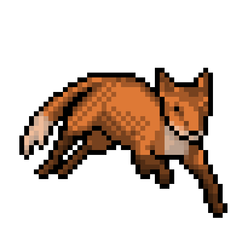

<p align="center"> 
	<a href= "https://archive.org/details/pocorgtfo"></a>
	<h3 align="center"> 🛡️ Cyber security - 🔵 Blue Team</h3>
</p>
<p align="center">
	<a href= "https://archive.org/details/pocorgtfo"></a>
</p>


```Py
class Electr1cF0x:
    def __init__(self):
        self.Language = "Python, C/C++, js, php"
        self.Contact =  "Operator-F0x@proton.me"
        self.LanguageAndTools = "Python , C , C++ , Js, Php, MySQL"
	
    def Me(self):
        print(f"Languages i know {self.Language}\n"
              f"you can contact me here: {self.Contact},\n"
              f"The languages or tools that I am studying and that I want to deepen: {self.LanguageAndTools}.")
	      
AllAbout = Saywoc()
AllAbout.Me()
```
